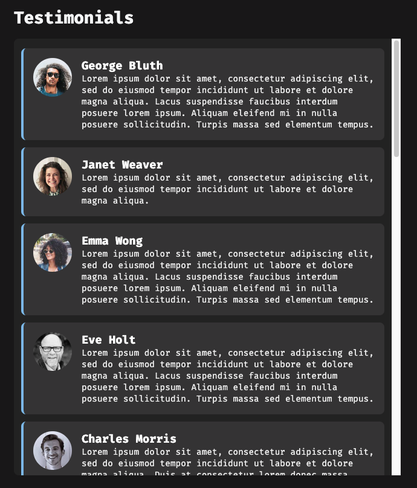

# Infinite Scroll

You're given an API endpoint that returns a list of AlgoExpert testimonials, and you have to fetch and display these testimonials on the page.

The API expects GET requests at this URL:

`https://api.frontendexpert.io/api/fe/testimonials`

Since there might be a lot of testimonials, you'll have to use the API endpoint's pagination functionality to repeatedly fetch a limited number of testimonials at a time. Specifically, the API accepts the following two query parameters:

- `limit` (required): the maximum number of testimonials to request.
- `after` (optional): a string ID used as a cursor for pagination. For instance, if the last testimonial you fetched had an ID of `"55"`, adding `after=55` to the URL would fetch testimonials starting after the testimonial with ID `"55"`.

For example, this would be a valid URL to request:

`https://api.frontendexpert.io/api/fe/testimonials?limit=2&after=55`

The API responds with a JSON object containing two keys: a `"hasNext"` boolean, which will be `false` if the response includes the last testimonial in the database, and a `"testimonials"` array, which contains testimonial objects, each with a string `"message"` and a unique string `"id"`, to be used as the `after` query parameter.

For example, the URL above might respond with:

```json
{
  "hasNext": true,
  "testimonials": [
    {
      "message": "Excellent product!",
      "id": "42"
    },
    {
      "message": "Love it, 5/5 stars!",
      "id": "55"
    }
  ]
}
```

This response would indicate that there are more testimonials to be fetched after the testimonial with ID `"55"`, since `"hasNext"` is `true`.

You've been given HTML and CSS files to help you display these testimonials on the page. Specifically, the HTML file contains an empty `#testimonial-container` div, to which you should append the testimonials. The content of each testimonial should be placed inside a div element with the `testimonial` class. Once testimonials have been displayed on the page, the HTML should look similar to this:

```html
<div id="testimonial-container">
  <div class="testimonial"></div>
  <div class="testimonial"></div>
  <div class="testimonial"></div>
</div>
```

Regarding exact functionality, you should fetch 5 testimonials and append them to the testimonial container as soon as the page loads. Then, whenever the user scrolls to the bottom of the testimonial container, you should fetch another 5 testimonials and append them.

Note that:

- Only one API call should be issued at a time; when one call is pending, no other calls should be issued, even if the user is scrolling down.
- Once all testimonials have been fetched, you should no longer makes calls to the API.
- You should use the global `fetch()` method to make requests to the API (call `fetch()` directly; don't call `window.fetch()`).
- You should listen to `"scroll"` events (don't use `IntersectionObserver`).

Refer to the design file for the exact design requirements (excluding the image for each testimonial).

